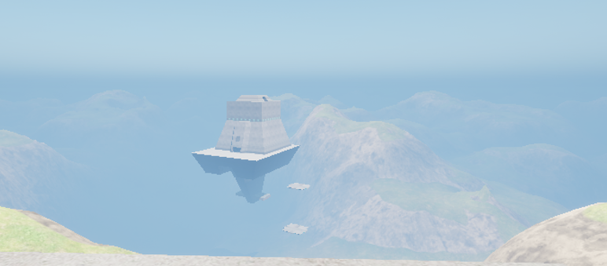

# UE5 Starsiege:Tribes - Mapping

### ⭐Prerequisites ⭐

- Unreal Engine `5.3.2`
- Visual Studios `2022`
  -  You will need the following Visual Studios packages, you can install via your `Visual Studio Installer` application. 

________________________________________________________

2.) Take the `ModFPSZ.zip` file and export the entire contents to your `.../YourProject/Plugins`

________________________________________________________

### ⭐Import Heightmaps into Unreal Engine 5⭐

##### ⭐To begin; Download Unreal Engine 5.⭐

WIP...

________________________________________________________
## ⭐Creating a Terrain Asset⭐

1.) Go to your content directory folder within the editor.

2.) Create Folder structure by right-clicking, and selecting `New Folder`

 

name it `Heightmaps` and open it up.


3.) Import your heightmap


You should see something as such


4.) Now right click on the open area and navigate to the bottom go to `Miscellaneous > Data Asset` 


You will be given a filter menu, you will need to search for `Terrain Asset`.


4.) Create a name such a `TA_Broadside`, and now open it.

Your new Terrain Asset should look like


Next you will need to select the `+` next to `Heightmap List` array element.

This will produce a new dropdown


From here, you will need to select the `none` drop down, and search for your Heightmap asset, and select.


Depending on the map that you imported, and working on will determine the height and scale that you set your map to. Please reference the tables below. If this is a custom-made heightmap disregard the tables below.

Once you have entered the Heightmap Height Scale, Size Scale, and updated Collision slices, select `Generate` at the top. This will automatically create the remaining components required.


Now save.

You have created a new Terrain Asset that you can link inside the `.mis` file for the map.

________________________________________________________ 


# ⭐# Creating & Updating the MIS file.⭐

#### ⭐ Helper Tool⭐
I have created a helper tool located within the main directory of this repository called `missionConvert.html` that will automatically perform the actions below. Simply open this page up in your preferred browser.


You will need to note that the current naming convention of the `.mis` file that you are going to be selecting, will generate your `TA_` naming convention for you automatically, however you can manually override this option by defining it within the `Terrain Asset Value:` input field.


## ⭐Configuring a MIS map file.⭐

Because the terrain is handled from Unreal engine, we will need to make a small modification to the map `.mis` file.

1.) Open up the `broadside.mis` file located with your `base/missions` folder in your games main directory.

________________________________________________________ 

## ⭐Terrain ⭐
You will need to locate the `instant SimGroup "Landscape" {}` and replace the entire contents with
```php
instant SimGroup "Landscape"{
    instant SimTerrain "Terrain"
    {
        TerrainAsset = "TA_Broadside";
        ClipmapMaterialClass = "M_TiledClipmap";
        ClipmapAsset = "CD_DefaultClipmap";
    };
};
```
________________________________________________________ 

## ⭐ Environmental Settings ⭐

There are various components to the Environmental settings that you can utilize. They each have a section below.

```
- Cloud
- Directional Light
- Fog
- Sky Atmosphere
- Sky Light
- Wind
```

With Unreal Engine 5 we are able to do some pretty remarkable stuff within the game world. We have tried to pack as much as we can, as far as dynamic settings, and what is capable of being defined within map files specifically.
________________________________________________________ 

# ⭐ Cloud
WIP
________________________________________________________ 

# ⭐ Directional Light
WIP
________________________________________________________ 

# ⭐ Fog

For more context as to what each setting does please visit the Unreal Engine 5 Documents on [UExponentialHeightFogComponent](https://docs.unrealengine.com/5.3/en-US/API/Runtime/Engine/Components/UExponentialHeightFogComponent/) I would also take a look at reading [An overview of the height-based, distant fog system.](https://docs.unrealengine.com/5.3/en-US/exponential-height-fog-in-unreal-engine/)

The available `.mis` file settings specifically to the `instant SimGroup` of `instant SimExponentialHeightFog "HeightFog";` options are

*Note If your `SimExponentialHeightFog` is set to `instant SimExponentialHeightFog "HeightFog";` you will need to update it as such

```
  instant SimExponentialHeightFog "HeightFog"{
    // Define Your Settings
  };
```

For Example; If you wanted to change fog density on Broadside you could define your settings as

```
  instant SimExponentialHeightFog "HeightFog"{
    fogDensity = 25.0;
  };
```

And Broadside would go from


to



Or you can go as crazy and make Broadside eerie 👻 by setting the FogDensity to 80%


Explore some of the advanced options listed below.

*Note If you know of appropriate ranges for each of these settings please let me know and I can update these docs. I just plugged in random values to test that they worked, and that I got some effect on screen.

```
  fogDirectionalInscatteringColor = "0.0, 0.0, 0.0, 0.0";
  fogDirectionalInscatteringExponent = 0.0;
  fogDirectionalInscatteringStartDistance = 0.0;
  fogCutoffDistance = 0.0;
  fogDensity = 0.0;
  fogHeightFalloff = 0.0;
  fogHeightOffset = 0.0;
  fogInscatteringColor = "0.0, 0.0, 0.0, 0.0";
  fogMaxOpacity = 0.0;
  fogStartDistance = 0.0;
  volumetricFog = 0.0;
  volumetricFogAlbedo = "0.0, 0.0, 0.0, 0.0";
  volumetricFogDistance = 0.0;
  volumetricFogEmissive = "0.0, 0.0, 0.0, 0.0";
  volumetricFogExtinctionScale = 0.0;
  volumetricFogScatteringDistribution = 0.0;
```
________________________________________________________ 

# ⭐ Wind


For Speedtree assets only, but this will be available.

To define wind settings within your `mis` file, you may use the `SimWind "Wind"` object.

```
instant SimWind "Wind" {

};
```

The available attributes are:

```
windMinimumGustAmount = 3.0;
windMaximumGustAmount = 5.0;
windSpeed = 4.0;
windStrength = 2.0;
windRadius = 50.0;
windType = 1;
```

Wind Type is a `1` to represent `Directional` or `2` or `Point`. If set to `0` or anything else, no settings will be defined. And you may see a Map Settings warning depending on the defined value.
________________________________________________________ 

# ⭐ Sky Light
WIP
________________________________________________________ 

# ⭐ Sky Atmosphere

For more information see [Unreal Engine 5.3 Sky Atmosphere Component](https://docs.unrealengine.com/5.3/en-US/API/Runtime/Engine/Components/USkyAtmosphereComponent/)

```
  instant SimSkyAtmosphere "Sky Atmosphere" {
    // Define Your Settings
  };
```

```
  aerialPerspectiveViewDistanceScale = 0.0;
  atmosphereHeight = 0.0;
  bottomRadius = 0.0;
  groundAlbedo = "0.0, 0.0, 0.0, 0.0";
  heightFogContribution = 0.0;
  mieAbsorption = "0.0, 0.0, 0.0, 0.0";
  mieAbsorptionScale = 0.0;
  mieAnisotropy = 0.0;
  mieExponentialDistribution = 0.0;
  mieScattering = "0.0, 0.0, 0.0, 0.0";
  multiScatteringScale = 0.0;
  multiScatteringFactor = 0.0;
  otherAbsorption = "0.0, 0.0, 0.0, 0.0";
  otherAbsorptionScale = 0.0;
  rayleighExponentialDistribution = 0.0;
  rayleighScattering = "0.0, 0.0, 0.0, 0.0";
  rayleighScatteringScale = 0.0;
  skyLuminanceFactor = "0.0, 0.0, 0.0, 0.0";
```
________________________________________________________ 

##### Console Debug Messages
You can open up the `defaultgame.ini` settings and set `bDumpMapSettingsLog` to `True` or `False` to have a Console Map Settings output log for debugging purposes.
```
[/Script/JPB.SimLighting]
bDumpMapSettingsLog=True
```

*NOT FUNCTIONAL YET*

You may also use in game `setMapSettingsLog(1)` for true and `setMapSettingsLog(0)` for false.

________________________________________________________ 

### ⭐ Defining, or altering spawn points⭐

WIP...

________________________________________________________ 

# ⭐Heightmap & Map Reference Tables⭐
## ⭐Official Maps & Game Modes⭐

If the map shows an `x` within the Available column, then that terrain asset is available to be used natively.

#### Training Maps

| Available | Map                     | Terrain Asset   | Height | Scale | Slices  | Game Mode   | Heightmap |
|:----------|:------------------------|:----------------|:-------|:------|:--------|:------------|:----------|
| x         | Welcome                 | TA_Welcome      | 232    | 8     | 1       | Training    | x         |
| x         | Weapons                 | TA_Weapons      | 284    | 8     | 1       | Training    | x         |
| x         | Vehicle                 | TA_Vehicle      | 70     | 8     | 1       | Training    | x         |
| x         | Commander TargetLaser   | TA_Commander    | 232    | 8     | 1       | Training    | x         |
| x         | CTF                     | TA_CTF          | 100    | 8     | 1       | Training    | x         |
| x         | Towers                  | TA_Towers       | 170    | 8     | 1       | Training    | x         |
| x         | Retrieval               | TA_Retrieval    | 148    | 8     | 1       | Training    | x         |
| x         | Destroy                 | TA_Destroy      | 148    | 8     | 1       | Training    | x         |

#### Defend & Destroy

| Available | Map                     | Terrain Asset          | Height | Scale | Slices  | Game Mode        | Heightmap |
|:----------|:------------------------|:-----------------------|:-------|:------|:--------|:-----------------|:----------|
| x         | A Dish Best Served Cold | TA_ADishBestServedCold | 233    | 8     | 1       | Defend & Destroy | x         |
| x         | BloodyVengeance         | TA_BloodyVengeance     | 105    | 8     | 1       | Defend & Destroy | x         |
| x         | Hammer Down             | TA_HammerDown          | 261    | 8     | 1       | Defend & Destroy | x         |
| x         | No Quarter              | TA_NoQuarter           | 86     | 8     | 1       | Defend & Destroy | x         |
| x         | Seek And Destroy        | TA_SeekAndDestroy      | 159    | 8     | 1       | Defend & Destroy | x         |
| x         | Siege                   | TA_Siege               | 250    | 8     | 1       | Defend & Destroy | x         |


#### Find & Retrieve 

| Available | Map                     | Terrain Asset   | Height | Scale | Slices | Game Mode        | Heightmap |
|:----------|:------------------------|:----------------|:-------|:------|:-------|:-----------------|:----------|
| x         | DeathKnell              | TA_DeathKnell   | 138    | 8     | 1      | Find & Retrieve  | x         |
| x         | Fallen                  | TA_Fallen       | 100    | 8     | 1      | Find & Retrieve  | x         |
| x         | Fog of War              | TA_FogOfWar     | 119    | 8     | 1      | Find & Retrieve  | x         |
| x         | Mudslide                | TA_Mudslide     | 240    | 8     | 1      | Find & Retrieve  | x         |
| x         | No Man's Land           | TA_NoMansLand   | 158    | 8     | 1      | Find & Retrieve  | x         |
| x         | Strung Out              | TA_StrungOut    | 305    | 8     | 1      | Find & Retrieve  | x         |


#### Capture & Hold

| Available | Map                     | Terrain Asset       | Height | Scale | Slices | Game Mode        | Heightmap |
|:----------|:------------------------|:--------------------|:-------|:------|:-------|:-----------------|:----------|
| x         | Ant Hill                | TA_AntHill          | 153    | 8     | 1      | Capture & Hold   | x         |
| x         | Citadels                | TA_Citadels         | 94     | 8     | 1      | Capture & Hold   | x         |
| x         | Criss Cross             | TA_CrissCross       | 152    | 8     | 1      | Capture & Hold   | x         |
| x         | Peak Performance        | TA_PeakPerformance  | 167    | 8     | 1      | Capture & Hold   | x         |
| x         | Temple Of Doom          | TA_TempleOfDoom     | 73     | 8     | 1      | Capture & Hold   | x         |

#### Death Match

| Available | Map                     | Terrain Asset       | Height   | Scale   | Slices | Game Mode        | Heightmap |
|:----------|:------------------------|:--------------------|:---------|:--------|:-------|:-----------------|:----------|
| x         | Blood Runs Cold         | TA_BloodRunsCold    | 35       | 8       | 1      | Death Match      | x         |
| x         | King Under The Hill     | TA_KingUnderTheHill | 291      | 8       | 1      | Death Match      | x         |
| x         | Peekaboo                | TA_Peekaboo         | 284      | 8       | 1      | Death Match      | x         |
| x         | Sand Storm              | TA_SandStorm        | 64       | 8       | 1      | Death Match      | x         |
| x         | The Red Sands           | TA_TheRedSands      | 115      | 8       | 1      | Death Match      | x         |


#### Mission Training

| Available | Map                     | Terrain Asset     | Height  | Scale | Slices | Game Mode        | Heightmap |
|:----------|:------------------------|:------------------|:--------|:------|:-------|:-----------------|:----------|
| x         | Four Way Dance          | TA_FourWayDance   | 102     | 8     | 1      | Mission Training | x         |
| x         | Free For All            | TA_FreeForAll     | 153     | 8     | 1      | Mission Training | x         |
| x         | Lucky Seven             | TA_LuckySeven     | 62      | 8     | 1      | Mission Training | x         |
| x         | Triple Threat           | TA_TripleThreat   | 230     | 8     | 1      | Mission Training | x         |


#### Capture The Flag

| Available | Map                     | Terrain Asset        | Height | Scale | Slices | Game Mode        | Heightmap |
|:----------|:------------------------|:---------------------|:-------|:------|:-------|:-----------------|:----------|
| x         | Blastside               | TA_Broadside         | -      | -     | 1      | Capture The Flag | x         |
| x         | Desert Of Death         | TA_DesertOfDeath     | 107    | 8     | 1      | Capture The Flag | x         |
| x         | Ice Ridge               | TA_IceRidge          | 144    | 8     | 1      | Capture The Flag | x         |
| x         | Broadside               | TA_Broadside         | 232    | 8     | 1      | Capture The Flag | x         |
| x         | Dangerous Crossing      | TA_DangerousCrossing | 284    | 8     | 1      | Capture The Flag | x         |
| x         | Raindance               | TA_Raindance         | 70     | 8     | 1      | Capture The Flag | x         |
| x         | RollerCoaster           | TA_RollerCoaster     | 232    | 8     | 1      | Capture The Flag | x         |
| x         | Snowblind               | TA_Snowblind         | 100    | 8     | 1      | Capture The Flag | x         |
| x         | Stonehenge              | TA_Stonehenge        | 170    | 8     | 1      | Capture The Flag | x         |
| x         | Valhalla                | TA_Valhalla          | 148    | 8     | 1      | Capture The Flag | x         |

________________________________________________________ 

## Community Maps

L-Spiro - Golden Eye Maps

________________________________________________________ 
