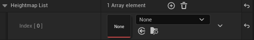

# UE5 Starsiege:Tribes - Mapping

## Start

### Prerequisites 

- Unreal Engine `5.3.2`
- Visual Studios `2022`
  -  You will need the following Visual Studios packages, you can install via your `Visual Studio Installer` application. 

2.) Take the `ModFPSZ.zip` file and export the entire contents to your `.../YourProject/Plugins`

### Import Heightmaps into Unreal Engine 5

##### To begin; Download Unreal Engine 5.

WIP...

## Creating a Terrain Asset

1.) Go to your content directory folder within the editor.

2.) Create Folder structure by right-clicking, and selecting `New Folder`

 

name it `Heightmaps` and open it up.

3.) Import your heightmap

You should see something as such

4.) Now right click on the open area and navigate to the bottom go to `Miscellaneous > Data Asset` 

You will be given a filter menu, you will need to search for `Terrain Asset`.

4.) Create a name such a `TA_Broadside`, and now open it.

Your new Terrain Asset should look like

Next you will need to select the `+` next to `Heightmap List` array element.

This will produce a new dropdown

From here, you will need to select the `none` drop down, and search for your Heightmap asset, and select.

Depending on the map that you imported, and working on will determine the height and scale that you set your map to. Please reference the tables below. If this is a custom-made heightmap disregard the tables below.

Once you have entered the Heightmap Height Scale, Size Scale, and updated Collision slices, select `Generate` at the top. This will automatically create the remaining components required.

Now save.

You have created a new Terrain Asset that you can link insice the `.mis` file for the map.

## Configuring a MIS map file.

1.) Open up the `broadside.mis` file located with your `base/missions` folder in your games main directory.

WIP...

# Heightmap & Map Reference Tables
## Maps & Game Modes v1.0.8

If the map shows an `x` within the Available column, then that terrain asset is available to be used natively.

#### Training Maps

| Available | Map                     | Terrain Asset   | Height | Scale | Slices  | Game Mode   | Heightmap |
|:----------|:------------------------|:----------------|:-------|:------|:--------|:------------|:----------|
| x         | Welcome                 | TA_Welcome      | 232    | 8     | 1       | Training    | x         |
| x         | Weapons                 | TA_Weapons      | 284    | 8     | 1       | Training    | x         |
| x         | Vehicle                 | TA_Vehicle      | 70     | 8     | 1       | Training    | x         |
| x         | Commander TargetLaser   | TA_Commander    | 232    | 8     | 1       | Training    | x         |
| x         | CTF                     | TA_CTF          | 100    | 8     | 1       | Training    | x         |
| x         | Towers                  | TA_Towers       | 170    | 8     | 1       | Training    | x         |
| x         | Retrieval               | TA_Retrieval    | 148    | 8     | 1       | Training    | x         |
| x         | Destroy                 | TA_Destroy      | 148    | 8     | 1       | Training    | x         |

#### Defend & Destroy

| Available | Map                     | Terrain Asset          | Height | Scale | Slices  | Game Mode        | Heightmap |
|:----------|:------------------------|:-----------------------|:-------|:------|:--------|:-----------------|:----------|
| x         | A Dish Best Served Cold | TA_ADishBestServedCold | 233    | 8     | 1       | Defend & Destroy | x         |
| x         | BloodyVengeance         | TA_BloodyVengeance     | 105    | 8     | 1       | Defend & Destroy | x         |
| x         | Hammer Down             | TA_HammerDown          | 261    | 8     | 1       | Defend & Destroy | x         |
| x         | No Quarter              | TA_NoQuarter           | 86     | 8     | 1       | Defend & Destroy | x         |
| x         | Seek And Destroy        | TA_SeekAndDestroy      | 159    | 8     | 1       | Defend & Destroy | x         |
| x         | Siege                   | TA_Siege               | 250    | 8     | 1       | Defend & Destroy | x         |

#### Find & Retrieve 

| Available | Map                     | Terrain Asset   | Height | Scale | Slices | Game Mode        | Heightmap |
|:----------|:------------------------|:----------------|:-------|:------|:-------|:-----------------|:----------|
| x         | DeathKnell              | TA_DeathKnell   | 138    | 8     | 1      | Find & Retrieve  | x         |
| x         | Fallen                  | TA_Fallen       | 100    | 8     | 1      | Find & Retrieve  | x         |
| x         | Fog of War              | TA_FogOfWar     | 119    | 8     | 1      | Find & Retrieve  | x         |
| x         | Mudslide                | TA_Mudslide     | 240    | 8     | 1      | Find & Retrieve  | x         |
| x         | No Man's Land           | TA_NoMansLand   | 158    | 8     | 1      | Find & Retrieve  | x         |
| x         | Strung Out              | TA_StrungOut    | 305    | 8     | 1      | Find & Retrieve  | x         |

#### Capture & Hold

| Available | Map                     | Terrain Asset       | Height | Scale | Slices | Game Mode        | Heightmap |
|:----------|:------------------------|:--------------------|:-------|:------|:-------|:-----------------|:----------|
| x         | Ant Hill                | TA_AntHill          | 153    | 8     | 1      | Capture & Hold   | x         |
| x         | Citadels                | TA_Citadels         | 94     | 8     | 1      | Capture & Hold   | x         |
| x         | Criss Cross             | TA_CrissCross       | 152    | 8     | 1      | Capture & Hold   | x         |
| x         | Peak Performance        | TA_PeakPerformance  | 167    | 8     | 1      | Capture & Hold   | x         |
| x         | Temple Of Doom          | TA_TempleOfDoom     | 73     | 8     | 1      | Capture & Hold   | x         |

#### Death Match

| Available | Map                     | Terrain Asset         | Height   | Scale   | Slices | Game Mode        | Heightmap |
|:----------|:------------------------|:----------------------|:---------|:--------|:-------|:-----------------|:----------|
| x         | Blood Runs Cold         | TA_BloodRunsCold      | 35       | 8       | 1      | Death Match      | x         |
| x         | King Under The Hill     | TA_KingUnderTheHill   | 291      | 8       | 1      | Death Match      | x         |
| x         | Peekaboo                | TA_Peekaboo           | 284      | 8       | 1      | Death Match      | x         |
| x         | Sand Storm              | TA_SandStorm          | 64       | 8       | 1      | Death Match      | x         |
| x         | The Red Sands           | TheRedSands           | 115      | 8       | 1      | Death Match      | x         |

#### Mission Training

| Available | Map                     | Terrain Asset     | Height  | Scale | Slices | Game Mode        | Heightmap |
|:----------|:------------------------|:------------------|:--------|:------|:-------|:-----------------|:----------|
| x         | Four Way Dance          | TA_FourWayDance   | 102     | 8     | 1      | Mission Training | x         |
| x         | Free For All            | TA_FreeForAll     | 153     | 8     | 1      | Mission Training | x         |
| x         | Lucky Seven             | TA_LuckySeven     | 62      | 8     | 1      | Mission Training | x         |
| x         | Triple Threat           | TA_TripleThreat   | 230     | 8     | 1      | Mission Training | x         |

#### Capture The Flag

| Available | Map                     | Terrain Asset        | Height | Scale | Slices | Game Mode        | Heightmap |
|:----------|:------------------------|:---------------------|:-------|:------|:-------|:-----------------|:----------|
| x         | Blastside               | TA_Broadside         | -      | -     | 1      | Capture The Flag | x         |
| x         | Desert Of Death         | TA_DesertOfDeath     | 107    | 8     | 1      | Capture The Flag | x         |
| x         | Ice Ridge               | TA_IceRidge          | 144    | 8     | 1      | Capture The Flag | x         |
| x         | Broadside               | TA_Broadside         | 232    | 8     | 1      | Capture The Flag | x         |
| x         | Dangerous Crossing      | TA_DangerousCrossing | 284    | 8     | 1      | Capture The Flag | x         |
| x         | Raindance               | TA_Raindance         | 70     | 8     | 1      | Capture The Flag | x         |
| x         | RollerCoaster           | TA_RollerCoaster     | 232    | 8     | 1      | Capture The Flag | x         |
| x         | Snowblind               | TA_Snowblind         | 100    | 8     | 1      | Capture The Flag | x         |
| x         | Stonehenge              | TA_Stonehenge        | 170    | 8     | 1      | Capture The Flag | x         |
| x         | Valhalla                | TA_Valhalla          | 148    | 8     | 1      | Capture The Flag | x         |

## Maps & Game Modes v1.1.1

## Community Maps
